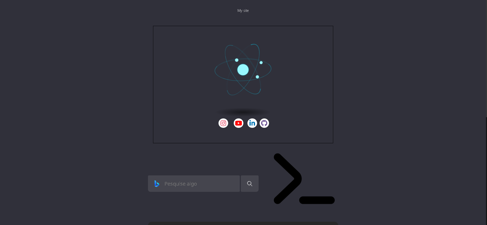
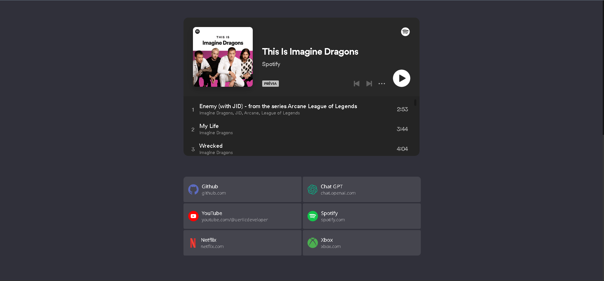

# Custom-HomePage

Personalize a página inicial de seu navegador com HTML e CSS!

Para você que acha a página inicial de seu navegador chata ou monótona eu trouxe a solução! Eu criei uma página inicial personalizada que serve principalmente para desenvolvedores, porém isso não impede que qualquer outro utilize. Confie em mim você irá gostar.

> Futuramente caso eu veja que vocês estão interessados eu posso trazer para outros públicos!
> 
> Para isso basta entra em contato comigo por qualquer forma citada no final deste documento.

## Exemplos:

## Como utilizar?
Para personalizar basta colocar essa url nas configurações de inicialização de seu navegador. Aqui estão formas de fazer em alguns navegadores: [Chrome](https://youtu.be/HEgnILdatHQ), [Egde](https://youtu.be/SgYsETeGma0), [Firefox](https://youtu.be/l-GF5st5gdw) e [Opera](https://youtu.be/OlgHePLg4Ng).